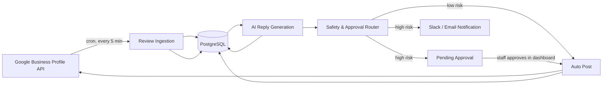

# Architecture

## What this is

An AI auto-reply system for Google reviews across ACE Training and MultiSkills Training's 8 campuses:
fetch new reviews, draft an on-brand AI reply, route low-risk ones straight to auto-post and flag
high-risk ones for a human, then post and log the result. Full business context is in the plan this repo
was built from (`../ACE & MST_Review_AutoReply_Proposal.pdf`, `../step-by-step.pdf`).

## Pipeline



## Repo layout

```
.env         the single config file both apps read
backend/     NestJS — REST API, cron scheduler, queue workers
  prisma/      schema, migrations, seed script
  src/         one folder per module (see table below)
frontend/    Next.js dashboard (App Router + Tailwind)
  src/         app/ pages, components/, lib/, types/
docs/        this folder
```

An npm workspace: one `node_modules` and one lock file at the root serve both apps, and both read
the single root `.env`. Each app keeps its own `package.json` (its dependency list) and its own
`tsconfig.json` — those cannot be merged, since NestJS compiles to CommonJS with decorators and
Next.js to ESM with JSX.

## Backend module map (`backend/src/`)

| Module | Responsibility |
|---|---|
| `config/` | Validates the root `.env` at boot and exposes it behind an injectable `APP_ENV` token. |
| `common/prisma/` | `PrismaService` — the one place the generated Prisma client is instantiated. |
| `users/` | Reads `User` rows. Enforces the safe-select allowlist that keeps `passwordHash` out of API responses. |
| `auth/` | Email+password login, JWT issuing/verification, `JwtAuthGuard`, `@CurrentUser()` decorator. |
| `brands/` | CRUD for brand tone/language/reply rules — what the AI prompt builder reads per brand. |
| `locations/` | Read access to campuses under a brand. |
| `reviews/` | Stores reviews with dedupe/edit detection; `ReviewProcessorService` orchestrates the whole pipeline. |
| `ai/` | Provider-agnostic reply generation (`AiProvider` interface; OpenAI is the default, Anthropic/Gemini swap in behind `AI_PROVIDER`) plus the per-brand prompt builder. |
| `safety/` | Rating + sensitive-content rules → auto-post vs needs-approval routing. Covered by tests. |
| `replies/` | Edit / approve / reject, preserving the original AI draft. |
| `notifications/` | Slack webhook + SMTP email alerts for held reviews; every attempt logged. |
| `reports/` | Aggregates for the dashboard's stat tiles and monthly report. |
| `platform-accounts/` *(not built)* | Google OAuth connect flow; `TokenVaultService` encrypts/decrypts stored tokens; discovers a connected account's locations. |
| `scheduler/` *(not built)* | `@Cron` job triggering an ingestion run per connected location. |

Everything except the two modules marked *(not built)* is implemented. Those two are what connect the
pipeline to real Google data — until then, reviews come from `prisma/seed-reviews.ts`.

### Why the pipeline runs synchronously

The original plan called for Redis + BullMQ. It isn't used: at the volume in the proposal (~128
reviews/month across 8 campuses) a queue adds an operational dependency and a whole failure mode
for no benefit. `ReviewProcessorService` processes reviews directly and records per-review failures,
so one bad review can't stop the others. If volume ever justifies it, the queue slots in behind that
same service without touching the AI, safety, or reply code.

### Why risk is assessed before the AI runs

`ReviewProcessorService` scores risk *first*, then generates the draft. That ordering means a review
that needs a human is flagged even if the AI provider is down or out of credit — the safety decision
never depends on a third party being reachable.

## Frontend map (`frontend/src/app/`)

- `(auth)/login` — email+password sign-in.
- `(dashboard)/layout.tsx` — sidebar (Dashboard, Reviews, Alerts, Reports, Settings) + redirects to
  `/login` if there's no session.
- `(dashboard)/reviews` — the review inbox: stat tiles, brand/status filters, search, and per-review
  approve / edit / reject.
- `(dashboard)/alerts` — just the reviews the safety router held for a human.
- `(dashboard)/reports` — stat tiles, a weekly stacked-bar chart, and a response-rate meter.
- `(dashboard)/settings` — edit each brand's AI tone via `PATCH /brands/:id`.

Charts are hand-rolled inline SVG (`components/reports/`) rather than a charting library: two charts
did not justify the dependency, and it keeps exact control over the mark specs. The palette in
`chart-tokens.ts` is validated for colour-blind separation and contrast — the comment there records
the measured values, so don't substitute colours by eye.

## Why these choices

- **Prisma over TypeORM** — one `schema.prisma` file is the readable source of truth for the whole data
  model, instead of entity classes spread across every module.
- **OpenAI as default AI provider, behind an interface** — `ai/providers/ai-provider.interface.ts` defines
  `generate()`; swapping to Anthropic/Gemini or adding both is a new file + one env var, not a rewrite.
  See the proposal's own note that Google/Facebook/Yelp support should work the same way via connector
  adapters — the AI provider is designed on the same principle.
  `PlatformAccount.platform` and `Review.platform` exist for the same reason: adding Facebook/Yelp later is
  a new connector module, not a schema migration.
