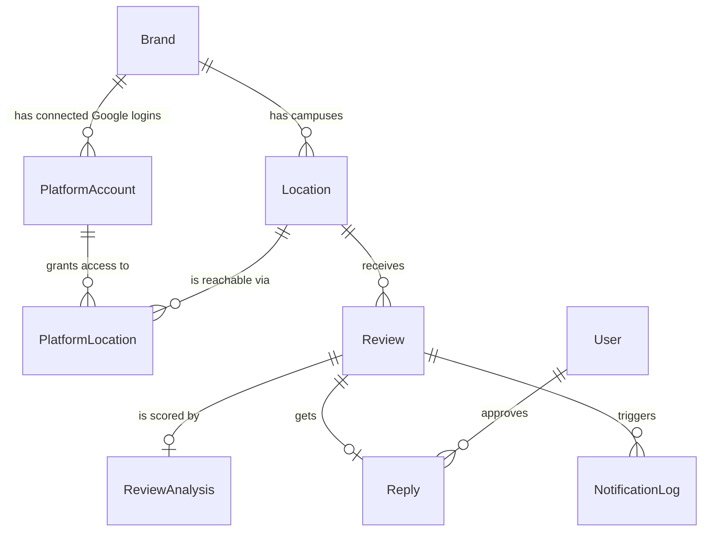

# Database

Schema source of truth: [`backend/prisma/schema.prisma`](../backend/prisma/schema.prisma).
This document explains *why* each table exists in plain language — read it before reading the schema.

## Entity relationship diagram

`JobRunLog` has no foreign keys — it's a flat audit trail of cron/queue executions, not part of the business graph.

## Tables, one at a time

**`users`** — staff who log into the dashboard (email + argon2 password hash + role). `passwordHash` must never
be returned by an API response; `UsersService.findSafeById` in the API enforces this with an explicit
Prisma `select` allowlist rather than trusting every caller to remember to strip it.

**`brands`** — the two clients, ACE Training and MultiSkills. Holds the AI's instructions per brand: `tone`
(free text describing how replies should sound), `language`, `replyRules` (structured JSON for rules the
prompt builder can enforce, e.g. "never mention pricing"), and `forbiddenWords`. This is what makes one
review-processing pipeline produce differently-voiced replies for each brand.

**`locations`** — a single campus/center under a brand. Everything downstream (reviews, platform connections)
hangs off a location, not a brand directly, because reviews are collected per physical Google Business
Profile location.

**`platform_accounts`** — one connected Google login for a brand. Stores the OAuth access/refresh token
**encrypted** (see [CREDENTIALS.md](CREDENTIALS.md)) and when the access token expires so it can be
refreshed proactively.

**`platform_locations`** — the join between a `platform_account` and the `locations` it actually has access
to, plus the external Google location id needed to call the Business Profile API. Split out from
`platform_accounts` because one Google login commonly covers several campuses at once.

**`reviews`** — one row per review fetched from a platform. The unique constraint on
`(platform, locationId, externalReviewId)` is deliberate: it's what stops the ingestion cron from creating a
duplicate every time it re-polls, and it's the key used to detect that a review was *edited* (same id,
different content) rather than newly posted.

**`review_analyses`** — the AI's sentiment/risk read on a review, kept separate from `reviews` because it's
a derived judgement (and the only thing that can change if we improve the risk model later) rather than raw
source data. A 5-star review can still carry a `riskFlags` entry like `"complaint"`.

**`replies`** — the AI-drafted reply and its lifecycle: `GENERATED` → `PENDING_APPROVAL` or straight to
`APPROVED` → `POSTED` (or `FAILED`/`REJECTED`). `approvedByUserId` records who signed off on a manually
approved reply, for accountability.

**`notification_logs`** — a record of every Slack/email alert sent for a review, so "did anyone get notified
about this?" is answerable from the database instead of from someone's inbox.

**`job_run_logs`** — start/finish/status for every cron and queue job run. This is what the (future)
monitoring view reads to answer "is ingestion actually running, and did the last run succeed?".

## Conventions

- IDs are `cuid()` strings, not auto-increment integers — safe to generate client-side later, don't leak
  row counts.
- Every model has `createdAt`; mutable ones also have `updatedAt` (`@updatedAt`).
- Enums live in Prisma (`UserRole`, `Platform`, `ReviewStatus`, `RiskLevel`, `ReplyStatus`,
  `NotificationChannel`, `PlatformAccountStatus`, `JobStatus`). The backend imports them from
  `@prisma/client`; the dashboard declares its own plain string-union equivalents in
  `frontend/src/types/api.ts`, so the browser bundle never pulls in the database client.
